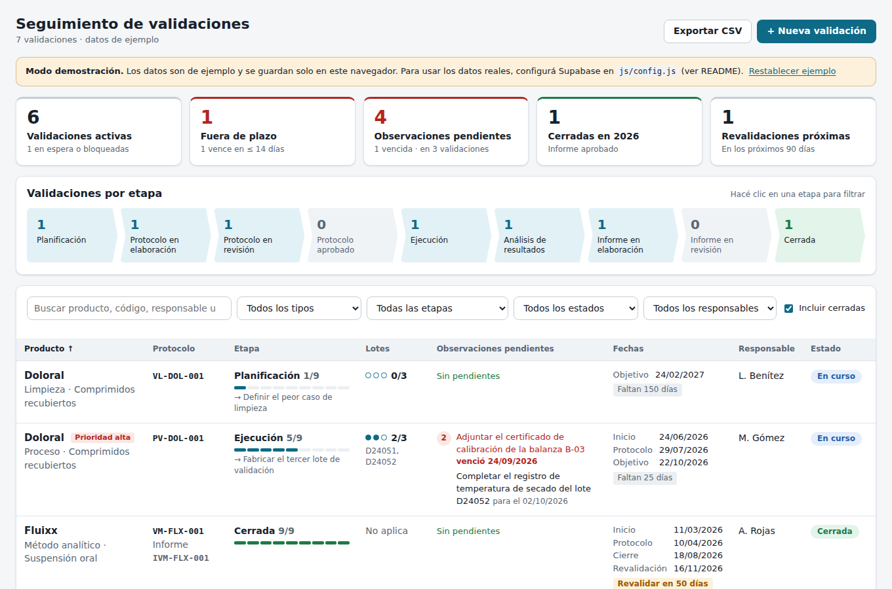

# Seguimiento de validaciones

Página web para seguir en una sola vista el estado de las validaciones de cada producto
(Doloral, Prostasil, Soluna, Sitiderm, Fluixx, Nistazinc…): código de protocolo, etapa,
observaciones pendientes y fechas. Los datos se guardan en [Supabase](https://supabase.com),
se comparten entre todos los usuarios y se pueden editar desde la misma página.



## Qué incluye

- **Resumen:** validaciones activas, fuera de plazo, observaciones pendientes (y vencidas),
  cerradas en el año y revalidaciones próximas. Al hacer clic en un indicador se filtra la tabla.
- **Validaciones por etapa:** cuántas validaciones hay en cada etapa del ciclo
  (Planificación → Protocolo → Ejecución → Informe → Cerrada). Al hacer clic se filtra.
- **Tabla principal**, una fila por producto y tipo de validación:
  - producto, presentación, tipo de validación (proceso, limpieza, método analítico…) y prioridad;
  - código de protocolo, código de informe y enlace a la carpeta de documentos;
  - etapa actual con barra de avance y próxima acción;
  - lotes ejecutados / requeridos y números de lote;
  - observaciones pendientes, marcando en rojo las que pasaron su fecha compromiso;
  - fechas de inicio, aprobación del protocolo, objetivo, cierre y próxima revalidación,
    con aviso de "vence en X días" o "vencida";
  - responsable y estado (en curso, en espera, bloqueada, cancelada, cerrada).
- **Búsqueda y filtros** por texto (sin importar acentos), tipo, etapa, estado y responsable.
  Las columnas se ordenan al hacer clic en el encabezado.
- **Panel de detalle** (clic en una fila) con tres pestañas:
  - *Datos:* edición de todos los campos;
  - *Observaciones:* agregar, editar, marcar como resueltas (se registra la fecha de cierre) o eliminar;
  - *Historial:* quién cambió qué y cuándo (por ejemplo, "Etapa: Ejecución → Análisis de resultados").
    Lo registra la base de datos automáticamente, así que también incluye los cambios hechos por SQL.
- **Exportar CSV** de la vista filtrada, listo para abrir en Excel. La página también se puede imprimir.
- **Varios usuarios a la vez:** la página se actualiza sola cuando otra persona hace un cambio. Si dos
  personas editan la misma validación, los cambios en campos distintos se combinan. Si cambiaron el
  mismo campo, la página avisa antes de reemplazar el valor.
- Funciona en computadora y en el celular, en modo claro y oscuro.

## Puesta en marcha

### 1. Crear la base de datos en Supabase

1. Crear una cuenta y un proyecto nuevo en <https://supabase.com> (el plan gratuito alcanza).
2. Ir a **SQL Editor → New query**, pegar el contenido de [`supabase/schema.sql`](supabase/schema.sql)
   y presionar **Run**. Esto crea las tablas, el historial automático y los permisos.
3. En otra consulta, ejecutar [`supabase/seed.sql`](supabase/seed.sql). Esto carga los seis productos
   en etapa *Planificación*. Los códigos de protocolo, las fechas y las observaciones se completan
   después desde la página.

### 2. Crear los usuarios

Solo pueden ver y editar los datos las personas con usuario.

1. **Authentication → Sign In / Providers:** desactivar **Allow new users to sign up**.
   Así nadie puede crearse una cuenta por su cuenta. Este paso es importante: la página es pública,
   pero los datos no.
2. **Authentication → Users → Add user → Create new user:** cargar email y contraseña de cada persona
   y marcar **Auto Confirm User**.

### 3. Conectar la página

En **Project Settings → API** (o **Data API**) copiar la *Project URL* y la clave *anon public*
(o *publishable*) en [`js/config.js`](js/config.js):

```js
export const SUPABASE_URL = 'https://xxxxxxxx.supabase.co';
export const SUPABASE_ANON_KEY = 'eyJhbGciOi...';
```

Esa clave está pensada para usarse en el navegador y se puede publicar. Lo que protege los datos es el
inicio de sesión más las políticas de seguridad (RLS) de `schema.sql`.
**No usar nunca la clave `service_role` en este archivo.**

Mientras `js/config.js` esté vacío, la página funciona en **modo demostración**, con datos de ejemplo
que se guardan solo en el navegador.

### 4. Publicar la página

La página no necesita compilación: son archivos estáticos.

- **GitHub Pages:** en el repositorio, **Settings → Pages → Build and deployment → Deploy from a branch**.
  Elegir la rama con estos archivos y la carpeta `/ (root)`. La dirección queda como
  `https://<usuario>.github.io/Seguimiento-de-validaciones/`.
- **En la computadora**, para probar: desde la carpeta del proyecto ejecutar `python3 -m http.server 8080`
  (o `npx serve .`) y abrir <http://localhost:8080>. Abrir `index.html` con doble clic no funciona,
  porque el navegador bloquea los módulos JavaScript fuera de un servidor.

## Uso diario

- **Nueva validación:** botón **+ Nueva validación**. Un mismo producto puede tener varias
  (por ejemplo, validación de proceso y de limpieza).
- **Avanzar de etapa:** abrir la fila y cambiar *Etapa*. Al pasar a *Cerrada*, la fecha de cierre se
  completa con la de hoy si estaba vacía.
- **Observaciones:** pestaña *Observaciones*. El círculo marca la observación como resuelta, y
  volver a hacer clic la reabre.
- **Plazos:** una validación figura "fuera de plazo" si su fecha objetivo ya pasó y no está cerrada.
  Figura "por vencer" si faltan 14 días o menos.

## Personalizar las etapas

Las etapas están en la tabla `etapas` y se pueden cambiar sin tocar el código. La de mayor `orden`
se considera el cierre. Ejemplos para el SQL Editor:

```sql
-- Renombrar una etapa (las validaciones que la usan se actualizan solas)
update etapas set nombre = 'Ejecución de lotes' where nombre = 'Ejecución';

-- Agregar una etapa intermedia: primero correr las siguientes para liberar el número
update etapas set orden = orden + 100 where orden >= 6;
update etapas set orden = orden - 99  where orden >= 100;
insert into etapas (orden, nombre, descripcion)
values (6, 'Estudio de estabilidad', 'Seguimiento de estabilidad de los lotes de validación');
```

## Actualizar datos por SQL

Además de la página, los datos se pueden cargar o corregir desde el **SQL Editor** de Supabase.
Todo queda en el historial.

```sql
-- Asignar código de protocolo y avanzar de etapa
update validaciones
set codigo_protocolo = 'PV-DOL-001', etapa = 'Protocolo en revisión', fecha_objetivo = '2026-12-15'
where producto = 'Doloral' and tipo_validacion = 'Proceso';

-- Registrar una observación pendiente
insert into observaciones (validacion_id, descripcion, responsable, fecha_compromiso)
select id, 'Falta firma de Producción en el protocolo', 'Producción', '2026-10-10'
from validaciones where producto = 'Doloral' and tipo_validacion = 'Proceso';

-- Ver lo pendiente
select v.producto, v.tipo_validacion, v.etapa, o.descripcion, o.fecha_compromiso
from observaciones o join validaciones v on v.id = o.validacion_id
where o.estado = 'Abierta'
order by o.fecha_compromiso nulls last;
```

## Estructura

| Archivo | Contenido |
|---|---|
| `index.html` | Estructura de la página |
| `css/styles.css` | Estilos (claro/oscuro, celular, impresión) |
| `js/app.js` | Vista, filtros, panel de edición, exportación |
| `js/store.js` | Acceso a datos: Supabase o modo demostración |
| `js/config.js` | URL y clave pública de Supabase |
| `js/demo.js` | Etapas y datos de ejemplo del modo demostración |
| `js/util.js` | Fechas y utilidades de texto |
| `supabase/schema.sql` | Tablas, historial automático, seguridad (RLS) y tiempo real |
| `supabase/seed.sql` | Carga inicial de productos |

La librería `supabase-js` se carga desde el CDN jsDelivr solo cuando Supabase está configurado.
